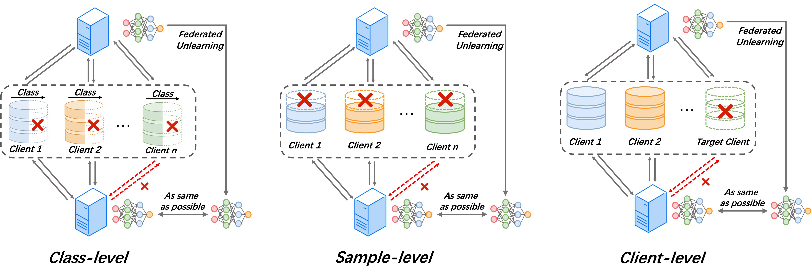
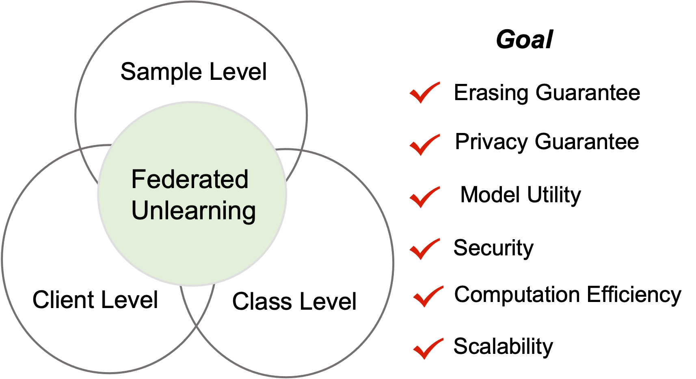

# A Survey of Federated Unlearning: A Taxonomy, Challenges and Future Directions

 

> 📖 Our survey paper of Federated Unlearning is coming !!

> 📧 Feel free to contact us if you come across any errors. We greatly appreciate any suggestions to enhance our work, so please don't hesitate to send me (<a href="https://abbottyanginchina.github.io">Jiaxi Yang</a>) email at _abbottyanginchina@gmail.com_ or my partner <a href="https://scholar.google.com/citations?user=JEG76EoAAAAJ&hl=zh-CN&oi=sra">Yang Zhao</a> at _s180049@e.ntu.edu.sg_

## Table of Contents
- [A Survey of Federated Unlearning: A Taxonomy, Challenges and Future Directions](#a-survey-of-federated-unlearning-a-taxonomy-challenges-and-future-directions)
  - [Table of Contents](#table-of-contents)
  - [Overview](#overview)
  - [Objectives of Federated Unlearning](#objectives-of-federated-unlearning)
  - [A taxonomy of Federated Unlearning](#a-taxonomy-of-federated-unlearning)
    - [Computation Efficiency](#computation-efficiency)
    - [Storage Efficiency](#storage-efficiency)
    - [Communication Efficiency](#communication-efficiency)
    - [Privacy](#privacy)
    - [Security](#security)
    - [Unlearning Guarantees](#unlearning-guarantees)
    - [Incentive Mechanism](#incentive-mechanism)
    - [Scalability](#scalability)
    - [Applications](#applications)
  - [Citing Awesome-Federated-Unlearning](#citing-awesome-federated-unlearning)

## Overview
**Federated Unlearning (FU)** addresses a federated learning scenario where clients collaborate to train and maintain a global model using a federated learning server. However, there may be situations which the target clients ask the aggregation server in federated learning to remove specific privacy-sensitive or illegal data contributions from the global model to safeguard privacy or mitigate legal risks. In response, the aggregation server should transform the model into an updated version that operates as if the erased data never took part in federated learning training. The framework of federated unlearning can be divided into three categories: _Class-level FU_, _Sample-level FU_, and _Client-level FU_.

## Objectives of Federated Unlearning
We outline several key objectives that are required for federated unlearning.

    

## A taxonomy of Federated Unlearning
### Computation Efficiency
+ [Federated Unlearning via Active Forgetting](https://arxiv.org/pdf/2307.03363.pdf) (Yuyuan Li et al., Arxiv 2023) [:book:](./citations/li2023federated.txt)
+ [BFU: Bayesian Federated Unlearning with Parameter Self-Sharing](https://dl.acm.org/doi/pdf/10.1145/3579856.3590327) (Weiqi Wang et al., Asia CCS 2023) [:book:](./citations/wang2023bfu.txt)
+ [Fast Federated Machine Unlearning with Nonlinear Functional Theory](https://openreview.net/pdf?id=6wQKmKiDHw) (Tianshi Che et al., ICML 2023) [:book:](./citations/che2023fast.txt)
+ [Forgettable Federated Linear Learning with
Certified Data Removal](https://arxiv.org/pdf/2306.02216.pdf) (Ruinan Jin et al., Arxiv 2023) [:book:](./citations/jin2023forgettable.txt)
+ [Heterogeneous Federated Knowledge Graph Embedding Learning and Unlearning](https://arxiv.org/pdf/2302.02069.pdf) (Xiangrong Zhu et al., WWW 2023) [:book:](./citations/zhu2023heterogeneous.txt)
+ [Unlearning Backdoor Attacks in Federated Learning](https://openreview.net/pdf?id=UnSZDmsFdxo) (Chen Wu et al., ICLRW 2023) [:book:](./citations/wu2023unlearning.txt)
+ [FedRecovery: Differentially Private Machine Unlearning for Federated Learning Frameworks](https://ieeexplore.ieee.org/abstract/document/10189868/) (Lefeng Zhang et al., TIFS 2023) [:book:](./citations/zhang2023fedrecovery.txt)
+ [Sequential Informed Federated Unlearning: Efficient and Provable Client Unlearning in Federated Optimization](https://arxiv.org/pdf/2211.11656.pdf) (Yann Fraboni et al., Arxiv 2023) [:book:](./citations/fraboni2022sequential.txt)
+ [Asynchronous Federated Unlearning](https://ningxinsu.github.io/assets/infocom23.pdf) (Ningxin Su et al., INFOCOM, 2022) [:book:](./citations/su2023asynchronous.txt)
+ [The Right to be Forgotten in Federated Learning: An Efficient Realization with Rapid Retraining](https://arxiv.org/pdf/2203.07320.pdf) (Liu Yi et al., INFOCOM 2022) [:book:](./citations/liu2022right.txt)
+ [Federated Unlearning: How to Efficiently Erase a Client in FL?](https://arxiv.org/pdf/2207.05521.pdf) (Anisa Halimi et al., Arxiv 2022) [:book:](./citations/halimi2022federated.txt)
+ [Federated Unlearning: Guarantee the Right of Clients to Forget](https://ieeexplore.ieee.org/stamp/stamp.jsp?tp=&arnumber=9964015) (Leijie Wu et al., IEEE Network 2022) [:book:](./citations/wu2022federated.txt)
+ [Federated unlearning with knowledge distillation](https://arxiv.org/pdf/2201.09441.pdf) (Chen Wu et al., Arxiv 2022) [:book:](./citations/wu2022federated.txt)
+ [Federated unlearning via class-discriminative pruning](https://arxiv.org/pdf/2110.11794.pdf) (Junxiao Wang et al., WWW 2022) [:book:](./citations/wang2022federated.txt)
+ [Federated Unlearning](https://arxiv.org/pdf/2012.13891.pdf) (Gaoyang Liu et al., Arxiv 2021) [:book:](./citations/liu2020federated.txt)
+ [FedEraser: Enabling Efficient Client-Level Data Removal from Federated Learning Models](https://ieeexplore.ieee.org/abstract/document/9521274) (Gaoyang Liu et al., IWQOS 2021) [:book:](./citations/liu2021federaser.txt)

### Storage Efficiency
+ [Federated Unlearning for On-Device Recommendation](https://arxiv.org/pdf/2210.10958.pdf) (Wei Yuan et al., WSDM 2023) [:book:](./citations/yuan2023federated.txt)
+ [Subspace based Federated Unlearning](https://arxiv.org/pdf/2302.12448.pdf) (Li Guanghao et al., Arxiv 2023) [:book:](./citations/li2023subspace.txt)
+ [The Right to be Forgotten in Federated Learning: An Efficient Realization with Rapid Retraining](https://arxiv.org/pdf/2203.07320.pdf) (Liu Yi et al., INFOCOM 2022) [:book:](./citations/liu2022right.txt)
+ [FedEraser: Enabling Efficient Client-Level Data Removal from Federated Learning Models](https://ieeexplore.ieee.org/abstract/document/9521274) (Gaoyang Liu et al., IWQOS 2021) [:book:](./citations/liu2021federaser.txt)

### Communication Efficiency
+ [Compressed Particle-Based Federated Bayesian Learning and Unlearning](https://arxiv.org/pdf/2209.07267.pdf) (Jinu Gong et al., IEEE Communications Letters 2022) [:book:](./citations/gong2022compressed.txt)
+ [Bayesian Variational Federated Learning and
Unlearning in Decentralized Networks](https://arxiv.org/pdf/2104.03834.pdf) (Jinu Gong et al.,  SPAWC 2021) [:book:]()

### Privacy
+ [Federated Unlearning and Its Privacy Threats](https://ieeexplore.ieee.org/abstract/document/10148937) (Fei Wang et al., IEEE Network 2023) [:book:](./citations/wang2023federated.txt)
+ [FedRecovery: Differentially Private Machine Unlearning for Federated Learning Frameworks](https://ieeexplore.ieee.org/abstract/document/10189868/) (Lefeng Zhang et al., TIFS 2023) [:book:](./citations/zhang2023fedrecovery.txt)
+ [Subspace based Federated Unlearning](https://arxiv.org/pdf/2302.12448.pdf) (Li Guanghao et al., Arxiv 2023) [:book:](./citations/li2023subspace.txt)

### Security
+ [Get Rid Of Your Trail: Remotely Erasing Backdoors in Federated Learning](https://arxiv.org/pdf/2304.10638.pdf) (Manaar Alam et al., Arxiv 2023) [:book:](./citations/alam2023get.txt)
+ [Unlearning Backdoor Attacks in Federated Learning](https://openreview.net/pdf?id=UnSZDmsFdxo) (Chen Wu et al., ICLRW 2023) [:book:](./citations/wu2023unlearning.txt)
+ [Federated unlearning with knowledge distillation](https://arxiv.org/pdf/2201.09441.pdf) (Chen Wu et al., Arxiv 2022) [:book:](./citations/wu2022federated.txt)

### Unlearning Guarantees
+ [Sequential Informed Federated Unlearning: Efficient and Provable Client Unlearning in Federated Optimization](https://arxiv.org/pdf/2211.11656.pdf) (Yann Fraboni et al., Arxiv 2023) [:book:](./citations/fraboni2022sequential.txt)
+ [FedME2: Memory Evaluation & Erase Promoting Federated Unlearning in DTMN](https://ieeexplore.ieee.org/abstract/document/10234397) (Hui Xia et al., JSAC, 2023) [:book:](./citations/xia2023fedme.txt)
+ [VERIFI: Towards Verifiable Federated Unlearning](https://arxiv.org/pdf/2205.12709.pdf) (Xiangshan Gao et al., Arxiv 2022) [:book:](./citations/gao2022verifi.txt)
+ [Federated Unlearning: How to Efficiently Erase a Client in FL?](https://arxiv.org/pdf/2207.05521.pdf) (Anisa Halimi et al., Arxiv 2022) [:book:](./citations/halimi2022federated.txt)

### Incentive Mechanism
+ [Incentive Mechanism Design for Federated Learning and Unlearning](https://arxiv.org/pdf/2308.12502.pdf) (Ningning Ding et al., Arxiv 2023) [:book:](./citations/ding2023incentive.txt)

### Scalability
+ [Sequential Informed Federated Unlearning: Efficient and Provable Client Unlearning in Federated Optimization](https://arxiv.org/pdf/2211.11656.pdf) (Yann Fraboni et al., Arxiv 2023) [:book:](./citations/fraboni2022sequential.txt)
+ [FedME2: Memory Evaluation & Erase Promoting Federated Unlearning in DTMN](https://ieeexplore.ieee.org/abstract/document/10234397) (Hui Xia et al., JSAC, 2023) [:book:](./citations/xia2023fedme.txt)

### Applications
+ [Federated Unlearning for On-Device Recommendation](https://arxiv.org/pdf/2210.10958.pdf) (Wei Yuan et al., WSDM 2023) [:book:](./citations/yuan2023federated.txt)
+ [FedME2: Memory Evaluation & Erase Promoting Federated Unlearning in DTMN](https://ieeexplore.ieee.org/abstract/document/10234397) (Hui Xia et al., JSAC, 2023) [:book:](./citations/xia2023fedme.txt)

## Citing Awesome-Federated-Unlearning
Our survey paper is coming.

