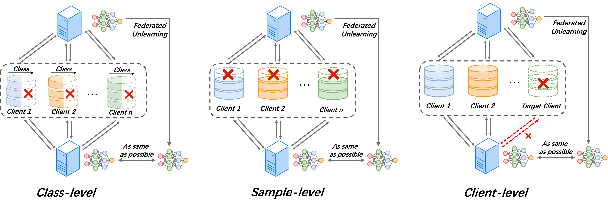
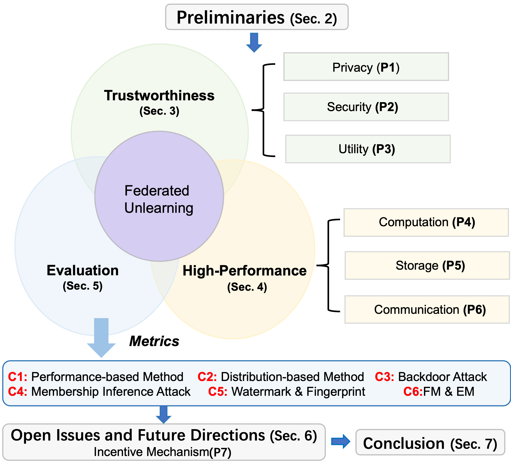

# A Survey of Federated Unlearning: A Taxonomy, Challenges and Future Directions

[](https://github.com/abbottyanginchina/Awesome-Federated-Unlearning)
 

> 📖 This project is related to our survey paper: 
<a href="https://arxiv.org/pdf/2310.19218.pdf">A Survey of Federated Unlearning: A Taxonomy, Challenges and Future Directions</a>

> 📧 Feel free to contact us if you come across any errors. We greatly appreciate any suggestions or new papers of FU to enhance our work, so please don't hesitate to send me (<a href="https://abbottyanginchina.github.io">Jiaxi Yang</a>) email at _abbottyanginchina@gmail.com_ or my partner <a href="https://scholar.google.com/citations?user=JEG76EoAAAAJ&hl=zh-CN&oi=sra">Yang Zhao</a> at _s180049@e.ntu.edu.sg_. 
<!-- In addition, you also can add my wechat: _15179190156_. -->

## News
- Our open source code library of FU named _OpenFU_ is coming !!!

## Citation
If you find this project useful for your research, please use the following BibTeX entry.
```
@article{yang2023survey,
  title={A Survey of Federated Unlearning: A Taxonomy, Challenges and Future Directions},
  author={Zhao, Yang, Yang, Jiaxi, Yiling Tao, Lixu Wang, Xiaoxiao Li and Dusit Niyato},
  journal={arXiv preprint arXiv:2310.19218},
  year={2023}
}
```

## Table of Contents
- [A Survey of Federated Unlearning: A Taxonomy, Challenges and Future Directions](#a-survey-of-federated-unlearning-a-taxonomy-challenges-and-future-directions)
  - [News](#news)
  - [Citation](#citation)
  - [Table of Contents](#table-of-contents)
  - [Overview](#overview)
  - [Taxonomy of Federated Unlearning](#taxonomy-of-federated-unlearning)
  - [Paper List of Federated Unlearning](#paper-list-of-federated-unlearning)
    - [Privacy (P1)](#privacy-p1)
    - [Security (P2)](#security-p2)
    - [Utility (P3)](#utility-p3)
    - [Computation Efficiency (P4)](#computation-efficiency-p4)
    - [Storage Efficiency (P5)](#storage-efficiency-p5)
    - [Communication Efficiency (P6)](#communication-efficiency-p6)
    - [Incentive Mechanism (P7)](#incentive-mechanism-p7)
    - [Applications](#applications)


## Overview
**Federated Unlearning (FU)** addresses a federated learning scenario where clients collaborate to train and maintain a global model using a federated learning server. However, there may be situations which the target clients ask the aggregation server in federated learning to remove specific privacy-sensitive or illegal data contributions from the global model to safeguard privacy or mitigate legal risks. In response, the aggregation server should transform the model into an updated version that operates as if the erased data never took part in federated learning training. The framework of federated unlearning can be divided into three categories: _Class-level FU_, _Sample-level FU_, and _Client-level FU_.



## Taxonomy of Federated Unlearning
We outline the taxonomy for federated unlearning.

<div style="text-align:center; width:100%; display: flex; justify-content: center; align-items: center;">
    
</div>


## Paper List of Federated Unlearning
### Privacy (P1)
+ [Federated Unlearning and Its Privacy Threats](https://ieeexplore.ieee.org/abstract/document/10148937) (Fei Wang et al., IEEE Network 2023) [:book:](./citations/wang2023federated.txt)
+ [FedRecovery: Differentially Private Machine Unlearning for Federated Learning Frameworks](https://ieeexplore.ieee.org/abstract/document/10189868/) (Lefeng Zhang et al., TIFS 2023) [:book:](./citations/zhang2023fedrecovery.txt)
+ [Subspace based Federated Unlearning](https://arxiv.org/pdf/2302.12448.pdf) (Li Guanghao et al., Arxiv 2023) [:book:](./citations/li2023subspace.txt)

### Security (P2)
+ [Get Rid Of Your Trail: Remotely Erasing Backdoors in Federated Learning](https://arxiv.org/pdf/2304.10638.pdf) (Manaar Alam et al., Arxiv 2023) [:book:](./citations/alam2023get.txt)
+ [Unlearning Backdoor Attacks in Federated Learning](https://openreview.net/pdf?id=UnSZDmsFdxo) (Chen Wu et al., ICLRW 2023) [:book:](./citations/wu2023unlearning.txt)
+ [Federated unlearning with knowledge distillation](https://arxiv.org/pdf/2201.09441.pdf) (Chen Wu et al., Arxiv 2022) [:book:](./citations/wu2022federated.txt)
+ [Revfrf: Enabling cross-domain random forest training with revocable federated learning](https://ieeexplore.ieee.org/abstract/document/9514457/) (Yang Liu et al., TDSC 2021) [:book:](./citations/liu2021revfrf.txt)
+ [Machine Unlearning of Federated Clusters](https://arxiv.org/pdf/2210.16424.pdf) (Pan et al., ICLR 2023) [:book:](./citations/pan2022machine.txt)
+ [FedRecovery: Differentially Private Machine Unlearning for Federated Learning Frameworks](https://ieeexplore.ieee.org/abstract/document/10189868/) (Lefeng Zhang et al., TIFS 2023) [:book:](./citations/zhang2023fedrecovery.txt)
+ [Federated Unlearning With Momentum Degradation](https://ieeexplore.ieee.org/abstract/document/10269017/) (Yian Zhao et al., IoT Journal 2023) [:book:](./citations/zhao2023federated.txt)

### Utility (P3)
+ [Get Rid Of Your Trail: Remotely Erasing Backdoors in Federated Learning](https://arxiv.org/pdf/2304.10638.pdf) (Manaar Alam et al., Arxiv 2023) [:book:](./citations/alam2023get.txt)
+ [FedRecovery: Differentially Private Machine Unlearning for Federated Learning Frameworks](https://ieeexplore.ieee.org/abstract/document/10189868/) (Lefeng Zhang et al., TIFS 2023) [:book:](./citations/zhang2023fedrecovery.txt)
+ [Federated Unlearning: How to Efficiently Erase a Client in FL?](https://arxiv.org/pdf/2207.05521.pdf) (Anisa Halimi et al., Arxiv 2022) [:book:](./citations/halimi2022federated.txt)
+ [VERIFI: Towards Verifiable Federated Unlearning](https://arxiv.org/pdf/2205.12709.pdf) (Xiangshan Gao et al., Arxiv 2022) [:book:](./citations/gao2022verifi.txt)
+ [Fast: Adopting federated unlearning to eliminating malicious terminals at server side](https://ieeexplore.ieee.org/abstract/document/10360312) (Guo Xintong et al., TNSE 2023) [:book:](./citations/guo2023fast.txt)
+ [How to Forget Clients in Federated Online Learning to Rank?](https://arxiv.org/pdf/2401.13410) (Shuyi Wang et al., ECIR 2023) [:book:](./citations/wang2024forget.txt)
+ [Federated Unlearning With Momentum Degradation](https://ieeexplore.ieee.org/abstract/document/10269017/) (Yian Zhao et al., IoT Journal 2023) [:book:](./citations/zhao2023federated.txt)
+ [FedME2: Memory Evaluation & Erase Promoting Federated Unlearning in DTMN](https://ieeexplore.ieee.org/abstract/document/10234397) (Hui Xia et al., JSAC, 2023) [:book:](./citations/xia2023fedme.txt)
+ [BFU: Bayesian Federated Unlearning with Parameter Self-Sharing](https://dl.acm.org/doi/pdf/10.1145/3579856.3590327) (Weiqi Wang et al., Asia CCS 2023) [:book:](./citations/wang2023bfu.txt)
+ [The Right to be Forgotten in Federated Learning: An Efficient Realization with Rapid Retraining](https://arxiv.org/pdf/2203.07320.pdf) (Liu Yi et al., INFOCOM 2022) [:book:](./citations/liu2022right.txt)
+ [Edge caching with federated unlearning](https://ieeexplore.ieee.org/abstract/document/10355067) (Pengfei Wang et al., IEEE Communications Magazine 2023) [:book:](./citations/wang2023edge.txt)
+ [Federated unlearning via class-discriminative pruning](https://arxiv.org/pdf/2110.11794.pdf) (Junxiao Wang et al., WWW 2022) [:book:](./citations/wang2022federated.txt)
+ [Federated Unlearning via Active Forgetting](https://arxiv.org/pdf/2307.03363.pdf) (Yuyuan Li et al., Arxiv 2023) [:book:](./citations/li2023federated.txt)


### Computation Efficiency (P4)
+ [Federated Unlearning via Active Forgetting](https://arxiv.org/pdf/2307.03363.pdf) (Yuyuan Li et al., Arxiv 2023) [:book:](./citations/li2023federated.txt)
+ [BFU: Bayesian Federated Unlearning with Parameter Self-Sharing](https://dl.acm.org/doi/pdf/10.1145/3579856.3590327) (Weiqi Wang et al., Asia CCS 2023) [:book:](./citations/wang2023bfu.txt)
+ [Fast Federated Machine Unlearning with Nonlinear Functional Theory](https://openreview.net/pdf?id=6wQKmKiDHw) (Tianshi Che et al., ICML 2023) [:book:](./citations/che2023fast.txt)
+ [Forgettable Federated Linear Learning with
Certified Data Removal](https://arxiv.org/pdf/2306.02216.pdf) (Ruinan Jin et al., Arxiv 2023) [:book:](./citations/jin2023forgettable.txt)
+ [Heterogeneous Federated Knowledge Graph Embedding Learning and Unlearning](https://arxiv.org/pdf/2302.02069.pdf) (Xiangrong Zhu et al., WWW 2023) [:book:](./citations/zhu2023heterogeneous.txt)
+ [Unlearning Backdoor Attacks in Federated Learning](https://openreview.net/pdf?id=UnSZDmsFdxo) (Chen Wu et al., ICLRW 2023) [:book:](./citations/wu2023unlearning.txt)
+ [FedRecovery: Differentially Private Machine Unlearning for Federated Learning Frameworks](https://ieeexplore.ieee.org/abstract/document/10189868/) (Lefeng Zhang et al., TIFS 2023) [:book:](./citations/zhang2023fedrecovery.txt)
+ [Sequential Informed Federated Unlearning: Efficient and Provable Client Unlearning in Federated Optimization](https://arxiv.org/pdf/2211.11656.pdf) (Yann Fraboni et al., Arxiv 2023) [:book:](./citations/fraboni2022sequential.txt)
+ [Asynchronous Federated Unlearning](https://ningxinsu.github.io/assets/infocom23.pdf) (Ningxin Su et al., INFOCOM, 2022) [:book:](./citations/su2023asynchronous.txt)
+ [The Right to be Forgotten in Federated Learning: An Efficient Realization with Rapid Retraining](https://arxiv.org/pdf/2203.07320.pdf) (Liu Yi et al., INFOCOM 2022) [:book:](./citations/liu2022right.txt)
+ [Federated Unlearning: How to Efficiently Erase a Client in FL?](https://arxiv.org/pdf/2207.05521.pdf) (Anisa Halimi et al., Arxiv 2022) [:book:](./citations/halimi2022federated.txt)
+ [Federated Unlearning: Guarantee the Right of Clients to Forget](https://ieeexplore.ieee.org/stamp/stamp.jsp?tp=&arnumber=9964015) (Leijie Wu et al., IEEE Network 2022) [:book:](./citations/wu2022federated.txt)
+ [Federated unlearning with knowledge distillation](https://arxiv.org/pdf/2201.09441.pdf) (Chen Wu et al., Arxiv 2022) [:book:](./citations/wu2022federated.txt)
+ [Federated unlearning via class-discriminative pruning](https://arxiv.org/pdf/2110.11794.pdf) (Junxiao Wang et al., WWW 2022) [:book:](./citations/wang2022federated.txt)
+ [Federated Unlearning](https://arxiv.org/pdf/2012.13891.pdf) (Gaoyang Liu et al., Arxiv 2021) [:book:](./citations/liu2020federated.txt)
+ [FedEraser: Enabling Efficient Client-Level Data Removal from Federated Learning Models](https://ieeexplore.ieee.org/abstract/document/9521274) (Gaoyang Liu et al., IWQOS 2021) [:book:](./citations/liu2021federaser.txt)
+ [Federated Unlearning for On-Device Recommendation](https://arxiv.org/pdf/2210.10958.pdf) (Wei Yuan et al., WSDM 2023) [:book:](./citations/yuan2023federated.txt)
+ [VERIFI: Towards Verifiable Federated Unlearning](https://arxiv.org/pdf/2205.12709.pdf) (Xiangshan Gao et al., Arxiv 2022) [:book:](./citations/gao2022verifi.txt)
+ [Fast: Adopting federated unlearning to eliminating malicious terminals at server side](https://ieeexplore.ieee.org/abstract/document/10360312) (Guo Xintong et al., TNSE 2023) [:book:](./citations/guo2023fast.txt)
+ [Machine Unlearning of Federated Clusters](https://arxiv.org/pdf/2210.16424.pdf) (Pan et al., ICLR 2023) [:book:](./citations/pan2022machine.txt)
+ [How to Forget Clients in Federated Online Learning to Rank?](https://arxiv.org/pdf/2401.13410) (Shuyi Wang et al., ECIR 2023) [:book:](./citations/wang2024forget.txt)
+ [Federated Unlearning With Momentum Degradation](https://ieeexplore.ieee.org/abstract/document/10269017/) (Yian Zhao et al., IoT Journal 2023) [:book:](./citations/zhao2023federated.txt)
+ [Blockchain-enabled Trustworthy Federated Unlearning](https://arxiv.org/pdf/2401.15917.pdf) (Yiling Lin et al., Arxiv 2024) [:book:](./citations/zhao2023federated.txt)
+ [Scalable Federated Unlearning via Isolated and Coded Sharding](https://arxiv.org/pdf/2401.15957.pdf) (Yiling Lin et al., Arxiv 2024) [:book:](./citations/lin2024scalable.txt)
+ [QuickDrop: Efficient Federated Unlearning by Integrated Dataset Distillation](https://arxiv.org/pdf/2311.15603.pdf) (Akash Dhasade et al., Arxiv 2023) [:book:](./citations/dhasade2023quickdrop.txt)
+ [Exact-fun: An exact and efficient federated unlearning approach](https://zuobinxiong.github.io/assets/pdf/ExactFedUnlearning.pdf) (Zuobin Xiong et al., ICDM 2023) [:book:](./citations/xiong2023exact.txt)

### Storage Efficiency (P5)
+ [Federated Unlearning for On-Device Recommendation](https://arxiv.org/pdf/2210.10958.pdf) (Wei Yuan et al., WSDM 2023) [:book:](./citations/yuan2023federated.txt)
+ [Subspace based Federated Unlearning](https://arxiv.org/pdf/2302.12448.pdf) (Li Guanghao et al., Arxiv 2023) [:book:](./citations/li2023subspace.txt)
+ [The Right to be Forgotten in Federated Learning: An Efficient Realization with Rapid Retraining](https://arxiv.org/pdf/2203.07320.pdf) (Liu Yi et al., INFOCOM 2022) [:book:](./citations/liu2022right.txt)
+ [FedEraser: Enabling Efficient Client-Level Data Removal from Federated Learning Models](https://ieeexplore.ieee.org/abstract/document/9521274) (Gaoyang Liu et al., IWQOS 2021) [:book:](./citations/liu2021federaser.txt)
+ [Federated unlearning with knowledge distillation](https://arxiv.org/pdf/2201.09441.pdf) (Chen Wu et al., Arxiv 2022) [:book:](./citations/wu2022federated.txt)
+ [Subspace based Federated Unlearning](https://arxiv.org/pdf/2302.12448.pdf) (Li Guanghao et al., Arxiv 2023) [:book:](./citations/li2023subspace.txt)

### Communication Efficiency (P6)
+ [Compressed Particle-Based Federated Bayesian Learning and Unlearning](https://arxiv.org/pdf/2209.07267.pdf) (Jinu Gong et al., IEEE Communications Letters 2022) [:book:](./citations/gong2022compressed.txt)
+ [Bayesian Variational Federated Learning and Unlearning in Decentralized Networks](https://arxiv.org/pdf/2104.03834.pdf) (Jinu Gong et al.,  SPAWC 2021) [:book:](./citations/gong2021bayesian.txt)
+ [Asynchronous Federated Unlearning](https://ningxinsu.github.io/assets/infocom23.pdf) (Ningxin Su et al., INFOCOM, 2022) [:book:](./citations/su2023asynchronous.txt)
+ [Federated Unlearning: How to Efficiently Erase a Client in FL?](https://arxiv.org/pdf/2207.05521.pdf) (Anisa Halimi et al., Arxiv 2022) [:book:](./citations/halimi2022federated.txt)
+ [Machine Unlearning of Federated Clusters](https://arxiv.org/pdf/2210.16424.pdf) (Pan et al., ICLR 2023) [:book:](./citations/pan2022machine.txt)
+ [Heterogeneous Federated Knowledge Graph Embedding Learning and Unlearning](https://arxiv.org/pdf/2302.02069.pdf) (Xiangrong Zhu et al., WWW 2023) [:book:](./citations/zhu2023heterogeneous.txt)
+ [Edge caching with federated unlearning](https://ieeexplore.ieee.org/abstract/document/10355067) (Pengfei Wang et al., IEEE Communications Magazine 2023) [:book:](./citations/wang2023edge.txt)
+ [Exact-fun: An exact and efficient federated unlearning approach](https://zuobinxiong.github.io/assets/pdf/ExactFedUnlearning.pdf) (Zuobin Xiong et al., ICDM 2023) [:book:](./citations/xiong2023exact.txt)
+ [Scalable Federated Unlearning via Isolated and Coded Sharding](https://arxiv.org/pdf/2401.15957.pdf) (Yiling Lin et al., Arxiv 2024) [:book:](./citations/lin2024scalable.txt)

### Incentive Mechanism (P7)
+ [Incentive Mechanism Design for Federated Learning and Unlearning](https://arxiv.org/pdf/2308.12502.pdf) (Ningning Ding et al., Arxiv 2023) [:book:](./citations/ding2023incentive.txt)

<!-- ### Privacy
+ [Federated Unlearning and Its Privacy Threats](https://ieeexplore.ieee.org/abstract/document/10148937) (Fei Wang et al., IEEE Network 2023) [:book:](./citations/wang2023federated.txt)
+ [FedRecovery: Differentially Private Machine Unlearning for Federated Learning Frameworks](https://ieeexplore.ieee.org/abstract/document/10189868/) (Lefeng Zhang et al., TIFS 2023) [:book:](./citations/zhang2023fedrecovery.txt)
+ [Subspace based Federated Unlearning](https://arxiv.org/pdf/2302.12448.pdf) (Li Guanghao et al., Arxiv 2023) [:book:](./citations/li2023subspace.txt)

### Security
+ [Get Rid Of Your Trail: Remotely Erasing Backdoors in Federated Learning](https://arxiv.org/pdf/2304.10638.pdf) (Manaar Alam et al., Arxiv 2023) [:book:](./citations/alam2023get.txt)
+ [Unlearning Backdoor Attacks in Federated Learning](https://openreview.net/pdf?id=UnSZDmsFdxo) (Chen Wu et al., ICLRW 2023) [:book:](./citations/wu2023unlearning.txt)
+ [Federated unlearning with knowledge distillation](https://arxiv.org/pdf/2201.09441.pdf) (Chen Wu et al., Arxiv 2022) [:book:](./citations/wu2022federated.txt)

### Unlearning Guarantees
+ [Sequential Informed Federated Unlearning: Efficient and Provable Client Unlearning in Federated Optimization](https://arxiv.org/pdf/2211.11656.pdf) (Yann Fraboni et al., Arxiv 2023) [:book:](./citations/fraboni2022sequential.txt)
+ [FedME2: Memory Evaluation & Erase Promoting Federated Unlearning in DTMN](https://ieeexplore.ieee.org/abstract/document/10234397) (Hui Xia et al., JSAC, 2023) [:book:](./citations/xia2023fedme.txt)
+ [VERIFI: Towards Verifiable Federated Unlearning](https://arxiv.org/pdf/2205.12709.pdf) (Xiangshan Gao et al., Arxiv 2022) [:book:](./citations/gao2022verifi.txt)
+ [Federated Unlearning: How to Efficiently Erase a Client in FL?](https://arxiv.org/pdf/2207.05521.pdf) (Anisa Halimi et al., Arxiv 2022) [:book:](./citations/halimi2022federated.txt) -->

<!-- ### Scalability
+ [Sequential Informed Federated Unlearning: Efficient and Provable Client Unlearning in Federated Optimization](https://arxiv.org/pdf/2211.11656.pdf) (Yann Fraboni et al., Arxiv 2023) [:book:](./citations/fraboni2022sequential.txt)
+ [FedME2: Memory Evaluation & Erase Promoting Federated Unlearning in DTMN](https://ieeexplore.ieee.org/abstract/document/10234397) (Hui Xia et al., JSAC, 2023) [:book:](./citations/xia2023fedme.txt) -->

### Applications
+ [Federated Unlearning for On-Device Recommendation](https://arxiv.org/pdf/2210.10958.pdf) (Wei Yuan et al., WSDM 2023) [:book:](./citations/yuan2023federated.txt)
+ [FedME2: Memory Evaluation & Erase Promoting Federated Unlearning in DTMN](https://ieeexplore.ieee.org/abstract/document/10234397) (Hui Xia et al., JSAC, 2023) [:book:](./citations/xia2023fedme.txt)
+ [How to Forget Clients in Federated Online Learning to Rank?](https://arxiv.org/pdf/2401.13410) (Shuyi Wang et al., ECIR 2023) [:book:](./citations/wang2024forget.txt)


